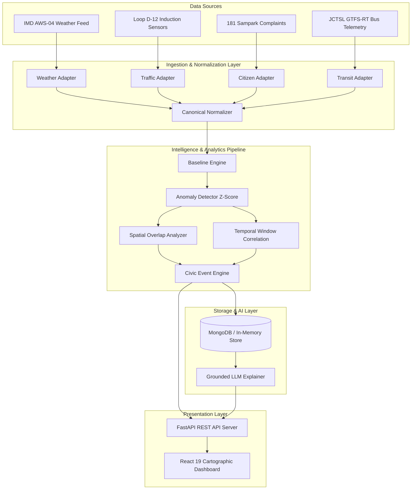

# CityPulse — System Architecture Documentation

## Overview

CityPulse is a live civic intelligence platform engineered to ingest, normalize, analyze, and explain multi-source municipal data streams.

---

## High-Level Architecture

---

## Engine Pipeline Workflow

1. **Ingestion Adapters**: Raw telemetry from disparate protocols (MQTT, REST, GTFS-RT, Sampark XML) is polled or streamed.
2. **Canonical Normalization**: Raw payloads are mapped to standard Observation schemas (`Observation`).
3. **Baseline Calculation & Anomaly Detection**: Current readings are evaluated against diurnal/seasonal baselines using threshold deltas and Z-scores.
4. **Spatial-Temporal Correlation**: Signals within the same spatial zone (`ZoneId`) and time window ($\tau \le 15 \text{ min}$) are joined into a candidate concordance set.
5. **Civic Event Generation**: Candidate sets meeting concordance thresholds ($\ge 75\%$) produce structured `CivicEvent` records with diagnostic chains.
6. **Grounded AI Explanation**: Structured evidence is passed to the LLM explainer module to generate human-readable summaries without hallucination.
7. **Cartographic UI**: React frontend presents real-time city state, interactive Leaflet map, evidence timeline, and historical replay.
